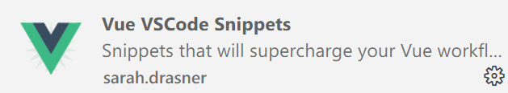

# Vue02

## 复习

WEB的发展史:

- 初始: `HTML` +`CSS`  制作静态页面
- JS出现: 让页面可以有逻辑操作, 灵活
  - DOM
- jQuery: 把复杂的DOM操作, 通过封装技巧变简单 -- 单词短了,代码少了
- Vue: `自动化` + `工程化` 思想出现 -- `巨大变革`
  - `自动化`: 我们只要修改数据, DOM元素会`自动`变化

## Vue相关内容

Vue属于前端三大框架之一: 尤雨溪开发的

- 3个版本
  - 版本1: 淘汰
  - 版本2: 主流, 过渡期..
  - 版本3: 未来
- 开发方式分`2`种
  - 脚本方式: 类似jQuery 引入脚本即可.  适合入门 或 简单网页开发
  - 脚手架: `工程化`的开发方式 -- 主流开发方式

创建Vue对象

- `new Vue()`: 创建时有固定的初始化`配置项`

  - data: 存储使用到的数据, 可以在HTML中使用
    - 数据都是存储在 `vue`对象里
  - el : vue对象服务的元素, 值是 id选择器
  - methods: 绑定给元素的方法
    - 方式中的this指向: `当前vue对象`

- 新的语法

  - 在HTML中提供了新的语法, 代表DOM操作

  - `{{}}` 插值语法, 类似 模板字符串的 `${}`  其中可以书写 JS代码

  - 属性绑定语法

    - vue1写法 `v-bind:属性名=""`
    - vue2写法 `:属性名="JS代码"`

  - 事件绑定语法

    - vue1写法 `v-on:事件名`

    - vue2写法 `@事件名`

      使用的差异: 如果方法不需要传递实参 `可以省略()`

      ```vue
      <button @click="事件方法" ></button>
      <button @click="事件方法(实参, 实参)" ></button>
      ```

## 插件

推荐一款翻译插件


## 复习

```html
<!DOCTYPE html>
<html lang="en">

<head>
  <meta charset="UTF-8">
  <meta http-equiv="X-UA-Compatible" content="IE=edge">
  <meta name="viewport" content="width=device-width, initial-scale=1.0">
  <title>复习</title>
</head>

<body>
  <div id="app">
    <!-- vue提供的新语法 {{}}, 在双标签中书写 JS 代码 -->
    <h1>title: {{title}}</h1>
    <!-- 属性用 : -->
    <a :href="baidu.href" :title="baidu.title">{{title}}</a>
    <a href="baidu.href" title="baidu.title">{{title}}</a>

    <h2>点击查看他们的爱好</h2>
    <div>
      <!-- 事件关联的方法, 必须书写在methods属性里 -->
      <button @click="showHobby('壮壮', '范凯')">壮壮</button>
      <button @click="showHobby('浩浩', '壮壮')">浩浩</button>
      <button @click="showHobby('文青', '浩浩')">文青</button>
      <button @click="showHobby('范凯', '文青')">范凯</button>

      <!-- 旧思想: 利用DOM查找到元素, 修改他的 innerTHML属性 -- 手动 -->
      <!-- 新思想: 把一个数据绑定在DOM元素上, 然后数据变化会 自动更新 -->
      <p>{{msg}}</p>
    </div>
  </div>

  <script src="./vendor/vue.js"></script>
  <script>
    new Vue({
      el: '#app', //固定属性: 配置vue对象服务的元素是哪个
      // data: 页面上使用的数据 放在此处
      data: {
        msg: '',
        title: "欢迎来到Vue的世界",
        baidu: { title: "百度一下", href: "http://www.baidu.com" }
      },
      // methods: 页面上使用的方法, 放在此处
      methods: {
        // 在语法糖的加持下,可以省略  :function
        // showHobby: function () { }
        showHobby(name, hobby) {
          // alert(`${name}喜欢${hobby}`)  // 某某某 喜欢 xxx

          // 修改数据, 页面会自动变化
          this.msg = `${name}喜欢${hobby}`
        }
      }
    })


  </script>
</body>

</html>
```


## 事件参数


```html
<!DOCTYPE html>
<html lang="en">

<head>
  <meta charset="UTF-8">
  <meta http-equiv="X-UA-Compatible" content="IE=edge">
  <meta name="viewport" content="width=device-width, initial-scale=1.0">
  <title>事件参数</title>
</head>

<body>
  <div id="app">
    <!-- 原生DOM的自定义属性, 代替事件传参写法 showHobby('打篮球') -->
    <button data-hobby="打篮球" @click="showHobby">壮壮</button>
    <button data-hobby="唱,跳" @click="showHobby">文青</button>

    <!-- 没有主动传参: 默认的参数1 是事件参数 -->
    <button @click="show">磊磊1</button>
    <!-- 带有（） 则进入 自定义传参模式 -->
    <button @click="show()">磊磊2</button>
    <button @click="show('哈哈哈哈')">柯晗</button>
    <!-- 自定义传参模式下, 如何传递事件参数 -->
    <button @click="show($event)">磊磊3</button>

  </div>

  <script src="./vendor/vue.js"></script>
  <script>
    // Vue作者的理念: 0 DOM操作  -- 不会DOM一样用vue
    new Vue({
      el: '#app',
      methods: {
        show(name) {
          console.log('name:', name)
        },

        showHobby(e) {
          // 事件参数e: 保存了当前事件相关的所有事项
          console.log(e)
          var hobby = e.target.dataset.hobby
          var name = e.target.innerHTML
          console.log(name, hobby)
        }
      }
    })
  </script>
</body>

</html>
```

## 显示/隐藏

```html
<!DOCTYPE html>
<html lang="en">

<head>
  <meta charset="UTF-8">
  <meta http-equiv="X-UA-Compatible" content="IE=edge">
  <meta name="viewport" content="width=device-width, initial-scale=">
  <title>指令 - 显示/隐藏</title>
</head>

<body>
  <!-- 指令: directive -->
  <!-- vue为元素提供了一些 属性, 带来一些新的效果 -->
  <div id="app">
    <!-- 到后台看 元素 -->
    <p v-show="true">壮壮</p>
    <!-- 所有 v- 开头的, 都是vue的指令 -->
    <p v-show="false">昌昌</p>
    <!-- 总结: 快速设置 style="display:none" -->
  </div>

  <script src="./vendor/vue.js"></script>
  <script>
    new Vue({
      el: "#app"
    })
  </script>
</body>

</html>
```

### 练习

```html
<!DOCTYPE html>
<html lang="en">

<head>
  <meta charset="UTF-8">
  <meta http-equiv="X-UA-Compatible" content="IE=edge">
  <meta name="viewport" content="width=device-width, initial-scale=1.0">
  <title>显示与隐藏</title>
  <style>
    #app {
      width: 300px;
    }

    #app>.title {
      background-color: #aaa;
      padding: 10px;
      user-select: none;
    }

    #app>.desc {
      background-color: #eee;
    }

    p {
      margin: 0;
      padding: 5px;
    }
  </style>
</head>

<body>
  <div id="app">
    <!-- show=其反值    即真的变假的, 假的变真的 -->
    <!-- HTML的属性需要:,  v- 是vue自己的不用加 -->
    <div class="title" @click="show=!show">
      点击{{show ? '收起' :'查看'}}男嘉宾信息
    </div>
    <!-- vue的思想: 凡是页面上会变的, 必然要绑定一个数据 -->
    <div class="desc" v-show="show">
      <p>姓名: 壮壮</p>
      <p>年龄: 28</p>
      <p>格言: 我是晕晕, 带你上王者</p>
      <p>特长: 无</p>
    </div>
  </div>

  <script src="./vendor/vue.js"></script>
  <script>
    new Vue({
      el: "#app",
      data: { show: false } //初始值false 不显示
    })
  </script>
</body>

</html>
```

## 标签切换

```html
<!DOCTYPE html>
<html lang="en">

<head>
  <meta charset="UTF-8">
  <meta http-equiv="X-UA-Compatible" content="IE=edge">
  <meta name="viewport" content="width=device-width, initial-scale=1.0">
  <title>标签栏切换</title>
  <style>
    .nav {
      border-bottom: 1px solid #e4393c;
      user-select: none;
      display: flex;
      background-color: #f7f7f7;
    }

    .nav>span {
      padding: 10px 30px;
    }

    .nav>span.active {
      background-color: #e4393c;
      color: white;
    }

    .desc {
      padding: 5px;
      background-color: #eee;
      /* 最小高度 */
      min-height: 40px;
    }
  </style>
</head>

<body>
  <div id="app">
    <div class="nav">
      <!-- vue思想: 凡是页面上会变化的, 肯定和数据有关-data -->

      <!-- 由于class的切换操作非常常见, 所以作者设置了一个语法 -->
      <!-- :class="{类名: true/false}"  true生效 false无效 -->
      <!-- :class="对象类型" -->
      <span :class="{active: n == 0}" @click="n=0">商品介绍</span>
      <span :class="{active: n == 1}" @click="n=1">规格与包装</span>
      <span :class="{active: n == 2}" @click="n=2">售后保障</span>
      <span :class="{active: n == 3}" @click="n=3">商品评价</span>
    </div>
    <p>n:{{n}}</p>
    <!-- 显示切换 v-show -->
    <div class="desc" v-show="n == 0">壮壮, 年方37, 喜欢打篮球 </div>
    <div class="desc" v-show="n == 1">三环一套房, 大众一辆, 20W存款</div>
    <div class="desc" v-show="n == 2">半年包退换, 大壮可选</div>
    <div class="desc" v-show="n == 3">你是个好人</div>
  </div>

  <script src="./vendor/vue.js"></script>
  <script>
    new Vue({
      el: "#app",
      data: { n: 0 } // 代表序号0的高亮
    })
  </script>
</body>

</html>
```


## 脚手架

后期工作中, 开发环境的完全体状态

- 脚手架是一个软件, 会自动帮你制作项目包, 包中包含 各种扩展工具, 代码提示, 报错提示...

  > 由于网络 和 电脑环境问题, 有些同学可能无法安装

  到百度网盘提前下载:

  ```
  第三阶段资源网盘地址
  https://pan.baidu.com/s/10oVRMBaEDL9uQSB1Jrrc3w
  提取码: 6666
  ```

  提前下载:

  

  下午第一节课带着安装生成: `小概率会无法安装, 与同学的电脑环境有关`

## npm环境

- node软件, 要求 `>=12` 的稳定版本 :`长期支持版本`  目前最新 `16.15.1`

  查看版本:`node -v`

  

- 如果版本不正确, 则需要`卸载` -> `重装`

  http://nodejs.cn/download/

- npm的下载源: 要求是中国的

  查看命令: `npm config get registry`

  

  修改为中国镜像: `npm config set registry https://registry.npm.taobao.org`

  

- 全局按照vue脚手架模块: `不成功 就是镜像单词不对 或 网不好, 按照笔记查`

  ```
  npm i -g @vue/cli
  ```

  安装后检查: 命令分两种 `vue --version` 或 `vue -V`

  

  如果`卡住`了, 可以尝试按回车.

  如果版本不是 `>=5`, 可以尝试升级命令: `npm update -g @vue/cli`

  > 如果无法完成, 从 卸载重装node 开始
  >
  > 还是不好用, 从 重装操作系统开始
  >
  > 还是不好用, 换电脑

## 使用脚手架

> 没安装成功的同学不用急, 直接用 之前网盘提供的即可

在你想生成项目包的目录下, 运行创建命令:  

> 注意,目录中不允许有 名字是vue.js的文件

- `vue create 项目名`

  - 项目名不允许有大写字母, 只能是 `小写字母 - 或 _`

  - 项目路径中`不允许`有中文和特殊符号

  - 目录下不能有同名文件夹

    

  - 同名报错:

    

- 选项: 手动模式

  

- 选项

  

- 版本2

  

- 剩余选项,都是`直接回车`, 不用输入任何东西

  

  

  

  

  成功后的提示如下:

  

最终得到项目包:


从百度网盘下载的就是这个


## 运行项目包

脚手架生成的项目包, 非常`专业`, 其中自带开发服务器, 也只能用这个服务器运行

在vue-pro 目录下执行启动命令: `npm run serve`


关于端口号, 默认是`8080`, 但是存在智能切换功能, 如果8080被其他程序占用


## 关于vscode

> vscode 必须`只` 开启项目包自己, 才能提供专业的服务
>
> 必须 一对一服务, 才有提示


## 插件

VSCode中有很多插件可以用, 不推荐乱按 -- 代码可能各种波浪线爆红




`不要`安装此插件,  vue3能用, vue2会有很多报错!


## 项目包目录结构


## main.js


## 关闭Git功能


## 脚手架的细节

- 项目包创建时: 不能有大写字母, 路径中只能是英文`字母 数字 _ -`
- 项目包启动: `npm run serve` 
  - vue项目包必须用自带的服务器, 在浏览器手动访问: `localhost:8080`
- Vscode: 必须 1对1 服务项目包 才能提供代码提示
- 插件: 不要装多了, 特别是推荐的 vue3 插件,  在vue2使用有错误
- 加载流程:
  - localhost:8080: 访问的是 `index.html`
  - main.js: 引入了 App.vue , 然后加载到 `id=app` 的元素上
  - App.vue: 导出vue代码
- `.vue`文件: 转为 vue 而生的文件, 写vue代码有各种提示
  - 注意事件: `只能有一个根元素`
  - 快捷提示: `<` 或 `vbase`


## 关于自动保存

每次修改一个代码, 都会自动保存 --`好用`

`但是:` vue脚手架项目包自带`热更新` -- 检测到代码的保存操作后, 自动刷新服务器

> 如果 自动保存 + 热更新:  每次输入字符 都会重启服务器;
>
> -- 电脑性能差的同学, 服务器可能会崩溃
>
> -- 如果卡, 就关掉自动保存 -- 要习惯自己 `ctrl+S` 保存代码


可以改成 失去焦点保存


## 初始

```html
<template>
  <!-- 只能一个子元素: vue2的要求 -->
  <div>
    <!-- 快速提示: 前提是安装插件 和 独享vscode服务 -->
    <!-- 使用 < 或 vbase 都可以 -->
    <!-- 有时 VSCode会主动推荐一些插件 -- 别听他的,不要装, 导致各种报错 -->
    <h1>Hello Vue!</h1>

    <!-- 如果不对: 可能是修改的代码 和 运行的服务器不是同一个项目包 -->
  </div>

  <!-- 规定: vue文件中, 只能有一个根元素 -->
  <!-- <h1>哈哈哈哈哈</h1> -->
</template>

<script>
// 模块的导出语法 -- JS独有的语法
// 成亮版本  module.exports = {}
// 亮亮版本  const xx = require('....')

// 新的导出语法 -- 几乎所有语言都是这种写法
// export default {}
// import xx from '....'

// App.vue 导出内容, 在main.js里引入, 最终显示在index.html的id=app的元素上
export default {};
</script>

<style lang="scss" scoped>
// 如果添加 lang='scss' 报错了, 说明项目包生的不对. 按照笔记重新生

// 有时间复习scss 以后要经常写
h1 {
  background-color: #aaa;
}
</style>
```

## 动态style

```html
<template>
  <div>
    <!-- vb生成 -->
    <!-- 通过复制粘贴 改名, 把代码做备份 -->
    <!-- 想用的时候, 就把代码粘贴到 App.vue 即可 -->
    <button @click="num++">{{ num }}</button>
    <!-- 动态style -->
    <!-- 格式  :style="{属性名:值}" -->
    <!-- 命名规范: 属性名不允许 中划线, 改小驼峰 或 字符串 -->
    <p :style="{ fontSize: `${num}px` }">Hello Vue!</p>

    <p :style="{ 'font-size': `${num}px` }">Hello Vue!</p>
  </div>
</template>

<script>
// 把{}当成是 new Vue({}) 就可以
export default {
  // data: 用于存放数据; 脚手架中 data必须是个函数, 通过return方式返回数据
  // 为什么?? 以后讲 -- 与复用有关
  // vdata
  data() {
    return {
      num: 10,
    };
  },
};
</script>

<style lang="scss" scoped>
</style>
```

## if

```html
<template>
  <div>
    <!-- v-if 指令: 通过if判断决定是否要显示元素 -->
    <button @click="show = true">添加</button>
    <button @click="show = false">移除</button>
    <div>show: {{ show }}</div>
    <p v-if="show">Hello Vue!</p>
    <!-- v-if的效果是  true显示元素, false隐藏元素;  与v-show相同 -->
    <!-- 面试经常问: -->
    <!-- 1. v-if 和 v-show 什么区别 -->
    <!-- v-if是通过移除/添加DOM元素实现, DOM方式 -->
    <!-- v-show是通过 display:none 实现, css方式 -->

    <!-- 2. 应该使用哪个? -->
    <!-- 场景1: 元素频繁切换显示与否, 用CSS方式更好 v-show -->
    <!-- 场景2: 适合一次性的切换, 例如页面的元素需要网络请求的数据 得到后再显示, 用v-if更合适.  可以把CPU资源先用在别的地方 -->
  </div>
</template>

<script>
export default {
  // vdata
  data() {
    return {
      show: true, //代表是否要显示
    };
  },
};
</script>

<style lang="scss" scoped>
</style>
```

## if-else

```html
<template>
  <div>
    <button @click="getScore">点击获取壮壮的月考成绩</button>
    <p>分数: {{ score }}</p>
    <!-- 利用if判断显示不同的评价 -->
    <p v-if="score == 100">不是本人吧? 禁止作弊!</p>
    <p v-else-if="score >= 90">优秀</p>
    <p v-else-if="score >= 60">继续努力</p>
    <p v-else>2204欢迎你</p>
    <!-- 看不懂, 去回顾亮亮讲解的 条件分支语句 -->
  </div>
</template>

<script>
export default {
  data() {
    return {
      score: "",
    };
  },
  // vmethod
  methods: {
    getScore() {
      // 如何获取 0~100间的随机数?
      // 0 - 1 * 101 变为 0 ~ 101 不含101
      let a = Math.random() * 101; // 0 ~ 1  不含1
      // 向下取值:floor     例如 100.9999 -> 100  小数直接舍去
      a = Math.floor(a);
      console.log(a);

      this.score = a;
    },
  },
};
</script>

<style lang="scss" scoped>
</style>
```

## once

```html
<template>
  <div>
    <div>拍卖剑桥同学的联系方式:</div>
    <!-- 猜一猜: v-once 什么意思 -->
    <!-- once: 一次性;  值初始显示后, 后续有变化 不再更新, 保持原样 -->
    <p v-once>起拍价: {{ price }}</p>
    <button @click="price -= 5">出价: -5</button>
    <p>当前价格: {{ price }}</p>
  </div>
</template>

<script>
export default {
  data() {
    return {
      price: 50,
    };
  },
};
</script>

<style lang="scss" scoped>
</style>
```

## pre

```html
<template>
  <div>
    <p>{{ uname }}</p>
    <!-- v-pre: 不解析{{}} 语法, 原样输出 -->
    <p v-pre>{{ uname }}</p>
  </div>
</template>

<script>
export default {
  data() {
    return {
      uname: "壮壮",
    };
  },
};
</script>

<style lang="scss" scoped>
</style>
```

## text与html

```html
<template>
  <div>
    <!-- v-text: 本质就是 innerText. 文本会替换掉标签中原内容 -->
    <p v-text="kw">111</p>
    <!-- v-html: 本质就是 innerHTML, 文本会当成HTML解析 替换原内容 -->
    <p v-html="kw">222</p>
  </div>
</template>

<script>
export default {
  data() {
    return {
      kw: "<h1>Hello Vue!</h1>",
    };
  },
};
</script>

<style lang="scss" scoped>
</style>
```

## v-for

```html
<template>
  <div>
    <!-- 以前: 把数据用map映射成html数组, join拼接, 添加到元素中 -->
    <!-- for..in   for..of -->
    <!-- v-for -->

    <!-- 波浪线不用管, 明天讲 -->

    <!-- 作者借鉴了 for of/in 的语法,  在vue中 in和of 含义相同, 都是遍历数组没有区别 -->
    <!-- v-for="变量 in/of 数组" -->
    <button v-for="skill in skills">{{ skill }}</button>
    <hr />
    <button v-for="skill of skills">{{ skill }}</button>
    <hr />
    <!-- 变量 of 数组:  变量随便起, 但是见名知意是原则 -->
    <button v-for="suibian of skills">{{ suibian }}</button>

    <!-- 序号 -->
    <hr />
    <!-- 固定格式 v-for="(值,序号) of/in 数组" -->
    <button v-for="(v, i) of skills">{{ i }}, {{ v }}</button>

    <!-- 关于波浪线: 可以预习 2202班的 key  的作用 -->
  </div>
</template>

<script>
export default {
  data() {
    return {
      skills: ["html", "css", "js", "dom", "vue"],
    };
  },
};
</script>

<style lang="scss" scoped>
</style>
```


## 回顾

指令: 就是vue提供的一些特殊的属性, 都是`v-`开头

- v-show: 显示还是隐藏, 利用css方式
- v-if: 移除/添加元素
- v-once: 一次性渲染, 后续不更新
- v-pre: 原样输出 `{{}}`
- v-text/v-html:  对应 innerText 和 innerHTML
- v-for: 遍历数组 生成元素

动态样式

- class
  - :class="{类: true/false}"  真生效 假不生效
- style
  - :style="{属性名: 值}"
  - 注意属性名带 `_`  需要小驼峰 或 字符串


## 作业

仿作出 百度的 登录页面效果

- 点击账号登录 和 短信登录 会出现不同的内容
- 参考: 今天练习的 京东那个
- 提示: 直接用截图的方式, 把变化的位置截图就行, 不需要自己写 CSS 和 HTML


